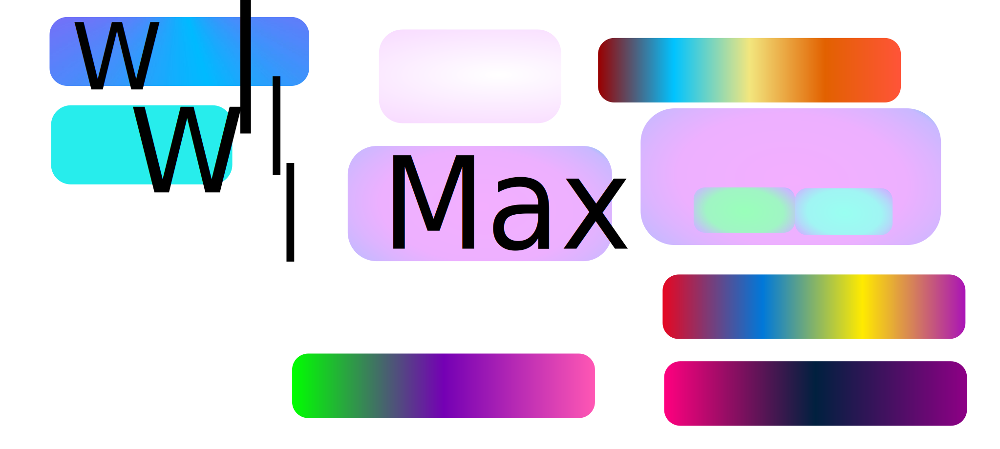

[](https://wakatime.com/@eff25b65-9015-4b5a-9bd6-96279cc396ce)

 
<!-- 

</br>


</img>


</img>


## Wakatime
(Added 27/3/2024)

 [](https://wakatime.com/@xMaxrayx) 


<picture>
  <source
    media="(prefers-color-scheme: dark)" 
    srcset="https://wakatime.com/share/@xMaxrayx/93a3f757-df4c-4801-8764-7ed7b72a7014.svg"
  >
  
  <source
    media="(prefers-color-scheme: light)"                 srcset="https://wakatime.com/share/@xMaxrayx/df1a99f5-5c91-4e81-a0bd-e61a1ec84d63.svg">
    
  >
  
  
</picture>


<br>
<br>
<br>
<br>
<br>


 `Other links` -> https://beacons.ai/xmaxrayx/home

------------

`HLDO0S OS`: Ultimate edition
```
Welcome to the HLD0OS 7.77 the new evlotion of opreating system
(RIP://Demon.xmaxrayx.HL)

FreeLove version 0.000
Freesuffer version 999999.9
HLD0OS version 7.77
HLD0OS Kernel 2066 (build 2066 7.77) [compiled oct 16 2077]

Preess Enter to continuo.....

C:\>help
        -> 
            Asking help for free? Oh you are poor? What a pathic.
            Oh you little kids and want your Family? 
            not my busnis to take others kid
         
         
C:\>dir
        ->
            Valume in drive HL is  HLD0OS666
            Valume Serial Number is 6666-11E6
            Dircectory of C:\
            
HLDOOS                          <DIR>     09-09-2078    03:00p 
TRUELOVE                        <DIR>     09-09-2078    08:10p
INNOCENTGAMMES                  <DIR>     10-16-2077    05:00p
AUTOMONEY             COM        1.66     03-06-2078    03:12p
FREELOVE              EXE        0.01     09-09-2078    09:00a
FREESUFFER            BAT      66.696     10-16-2077    01:00p   
BEFOREGOODBYE         TXT       0.100     10-16-2077    12:00a
HLDO0SCONFIG          SYS         774     10-15-2078    03:55a
KERNAL                SYS      46.333     10-16-2077    09:45p


C:\>shutdown
                ->
                     You are NOt allowed to escape.
                     

C:\> _


```
𐌌𐌙 𐌐𐌓ꝊᏵ𐌄𐌂𐌕, 
```
1. [`Extrude + + blender addon`](https://github.com/xmaxrayx/Blender3D_Extrude_Plus_Plus_addon) Extrude commands in Pia menue as addon for blenders


------------
<br>

<br>

<br>

<br>

<br>


1. [`Extrude + + blender addon`](https://github.com/xmaxrayx/Blender3D_Extrude_Plus_Plus_addon) Extrude commands in Pia menue as addon for blenders





 

